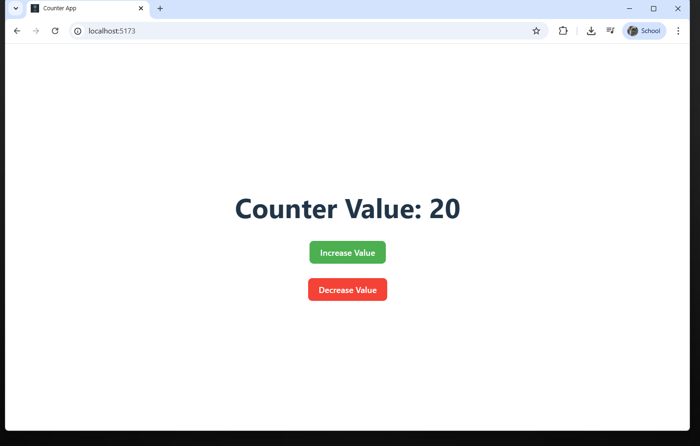

Counter App

A simple counter application built with React Hooks.

✨ Features

Uses the useState hook to manage the counter state.

Provides Increment and Decrement buttons to update the counter value.

Includes validation to restrict the counter value between 0 and 20 (inclusive).

🚀 Getting Started

Clone the repository:

git clone <your-repo-url>
cd counter-app

Install dependencies:

npm install

Start the development server:

npm run dev

🛠️ Tech Stack

React

JavaScript (ES6+)

CSS